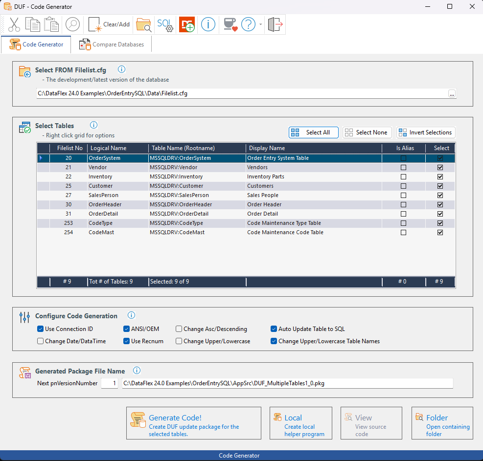
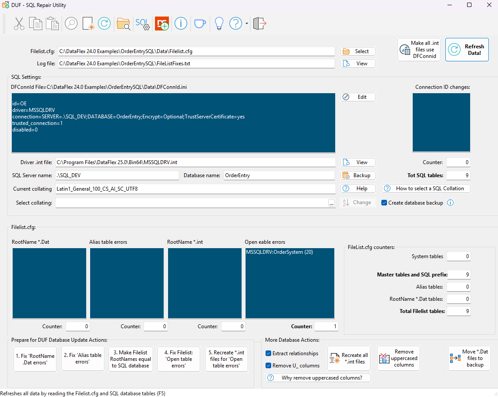

# DUF - DbUpdateFramework
Database Update Framework for DataFlex

The Database Update Framework is a code-based framework for making automated database updates. It is designed to make it easy to update databases at customer sites when, for example, installing a new revision of software that depends on changes made to the database before the new software version can run.

[Click here to see the Introduction Video at Youtube](https://www.youtube.com/watch?v=D2o0zjPEr_I)

[This is a more in-depth video about the framework](https://www.youtube.com/watch?v=VD4eN9oP0_U)

## Programs to Compile and Use
There are two programs you need to compile and use:
- **DUFCodeGenerator**
- **DUFFileListRepair**

You need to add a bit of code to your own program that makes the automated database update. You do this in the Studio by selecting a `cDbUpdateHandler` object from the Studio's Class Palette, and dragging it to your main program.

It is suggested to add the `DUFCodeGenerator.exe` and `DUFFileListRepair.exe` programs to the Studio’s Tools menu, by running them and pressing the “Add To Studio” button.

## Important
It is suggested to read the following help sections:
- “Welcome to the Database Update Framework”
- “Workspace Setup”
- “How to Use It”

These can be found in the `Developer5.chm` Help file located in the `/Help` folder. Of just press F1 while running one of the programs.

The workspace also uses other libraries that are published on NilsSve's GitHub page. This should not be of any concern to you as this should all be automatic when cloning this repository. Those libraries are used as submodules in git.
