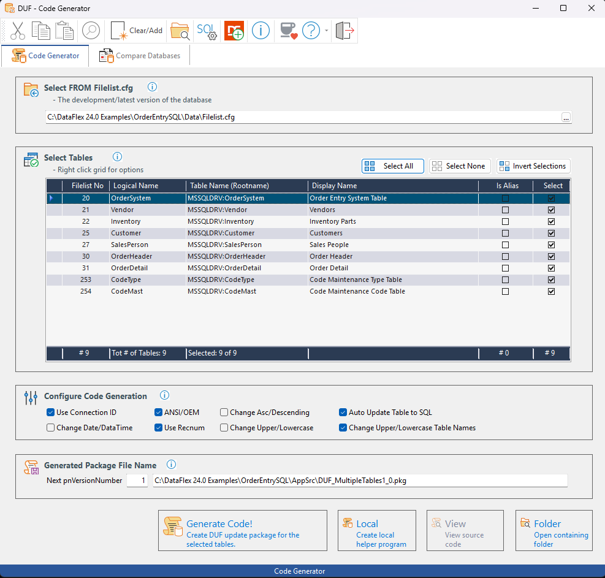
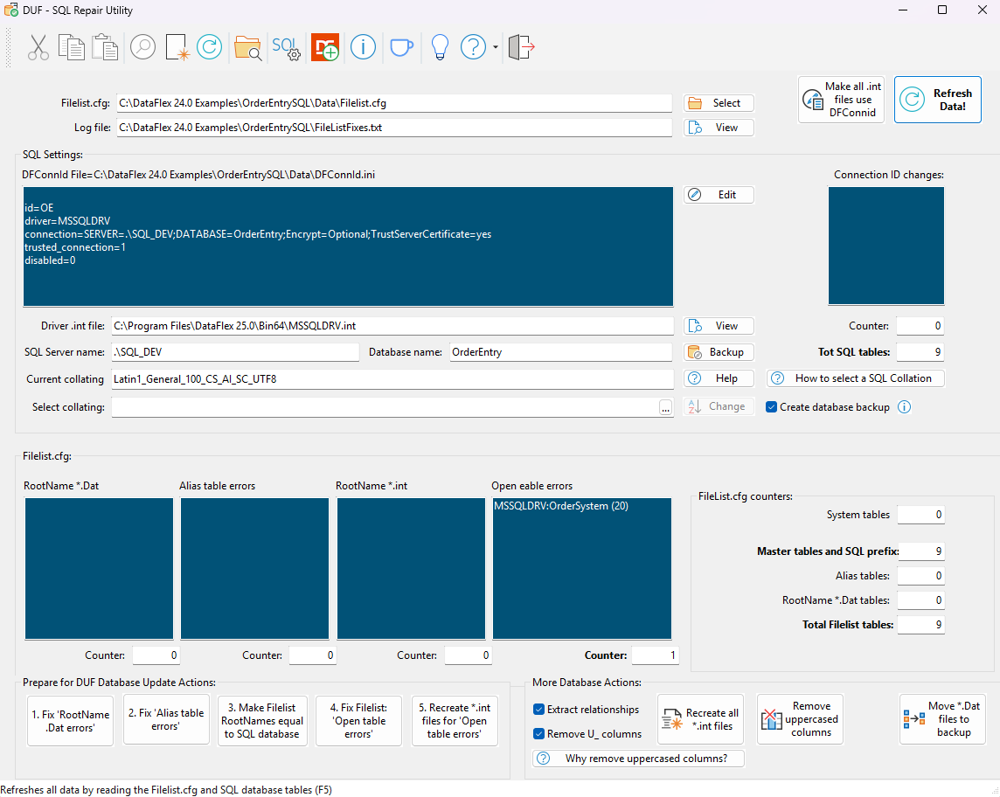

### DUF - Database Update Framework for DataFlex

It is highly recommended to download and install the GitHub Desktop app, as it will significantly simplify your work. You can download it via this link: https://desktop.github.com/download/.

Once installed, click the "<> Code" button at this GitHub page and select "Open with GitHub Desktop." This will install the complete repository in your chosen download location.

Note: Do not select "Download ZIP," as GitHub will not include the libraries used by the workspace, and you would need to download them manually, which can be cumbersome!

The Database Update Framework (DUF) is a code-based solution designed for automating database updates. It streamlines the process of updating databases at customer sites, particularly when installing a new software version that requires prior changes to the database.

[Click here to see the Introduction Video on YouTube](https://www.youtube.com/watch?v=D2o0zjPEr_I)

[Watch a more in-depth video about the framework](https://www.youtube.com/watch?v=VD4eN9oP0_U)

### Programs to Compile and Use

To implement the framework, you will need to compile and use two programs:
- **DUFCodeGenerator**
- **DUFSQLRepairUtility**

Additionally, you need to integrate a piece of code into your program to facilitate the automated database update. This can be done by selecting a `cDbUpdateHandler` object from the Studio's Class Palette and dragging it into your main program.

It is recommended to add the `DUFCodeGenerator.exe` and `DUFSQLRepairUtility.exe` programs to the Studio’s Tools menu. You can do this by executing the programs and clicking the “Add To Studio” button.

### Important Information

Before proceeding, please read the following help sections:
- “Welcome to the Database Update Framework”
- “Workspace Setup”
- “How to Use It”

These sections can be found in the `Developer5.chm` Help file located in the `/Help` folder. Alternatively, you can press F1 while running one of the programs for assistance.

The workspace also uses three other libraries from Nils Sve's GitHub page — DFAbout, RDCToolsLib and vwin32fh. As of the flattening described below, they are **no longer nested submodules of DUF**; they are separate sibling libraries. See the Dependencies section for why, and what a consuming application must do.

## Setup after cloning

**Building DUF on its own** (working on the framework itself): after cloning, run **`setup.bat`**
once from the repository root. It clones DFAbout, RDCToolsLib and vwin32fh as **siblings** of the
DUF folder — the layout `DUFDev25.0.sws` / `DUFDev26.0.sws` expect. Open one of the `DUFDev*.sws`
workspaces to build. Re-run `setup.bat` any time those sibling folders look missing or stale.

There is no plain `DUF25.0.sws`. The two workspace files are named for their role, so it is
always clear which to use:

| File | Role | `[Libraries]` |
|---|---|---|
| `DUFDev25.0.sws` / `26.0` | Open this to **develop** DUF | the three `..\` siblings |
| `DUFLibrary25.0.sws` / `26.0` | A consumer **references** this | none — deliberately empty |

`DUFLibrary*.sws` declaring no libraries is the point: when DUF is used as a library inside
another application, that application supplies the four-library flat set itself (see below), and
DUF must not drag its own copies onto the path. (The old single `DUF25.0.sws` had the empty
consumer file wearing the plain, inviting name — so it was the one people opened to work on DUF,
found no libraries, and hit a wall. Two role-named files remove that trap.)

That is the only setup step. In particular `Help\About.rtf` now ships with the repository — it
used to be gitignored, which meant a fresh clone could not compile at all until someone worked
out that `DfAbout.pkg` embeds that file as a program resource. What is committed is a minimal
placeholder; replace its text with whatever the About dialog should show, but do not delete the
file. Editing it in Word rewrites the whole thing, so expect whole-file diffs.

## Dependencies

DUF requires **RDCToolsLib**, **vwin32fh** and **DFAbout**. What each is actually for:

| Library | Why DUF needs it |
|---|---|
| RDCToolsLib | The `cRDC*` control classes and `RDCStatusPanel.pkg`, used throughout the dialogs and `cBaseDbUpdateFuncLib`. |
| vwin32fh | `vWin32fh.pkg`, used directly by `cBaseDbUpdateFuncLib` — and required by RDCToolsLib in its own right. |
| DFAbout | One class: `SysInfoDialog`, shown by `DriverSettings.dg`. Nothing else in DUF touches DFAbout. |

Note the shape of that last row. DUF is a database library, and its entire dependency on the
About-dialog library is a single System Information popup in one dialog. If DUF's dependency
list ever needs to get shorter, extracting `SysInfoDialog` into RDCToolsLib is the move.

### If you are consuming DUF from an application

Add all four — DUF, RDCToolsLib, vwin32fh and DFAbout — as submodules under your application's
`Libraries\`, and declare them as a flat sibling list in your application workspace's
`[Libraries]`. Do not rely on reaching the three through DUF; DUF's consumer `.sws` declares no
libraries precisely so that it cannot.

There are two reasons, and both are things this project has actually been bitten by:

1. **Version drift.** DataFlex resolves the compiler search path first-match-wins, with no version
   arbitration. If a library reached the path from two different checkouts, list order alone would
   decide which won, silently. One library, one checkout, declared by the application, is the only
   arrangement that cannot drift.

2. **The Studio navigates by disk, not by the path.** Even when the *build* is unambiguous, a
   second physical copy of a package on disk means Go-to-Definition and Find-in-Files can land on
   the wrong file — and you can edit one copy while the build compiles the other. Flat siblings
   mean exactly one physical copy of each library, so that cannot happen.

This is why DUF stopped nesting the three: nesting guaranteed a second physical copy inside every
consumer that also declared them as siblings. **Migrating a consumer:** add the three as siblings,
list all four flat in the workspace, and confirm there is no longer a
`Libraries\DUF\Libraries\` folder shadowing them.
